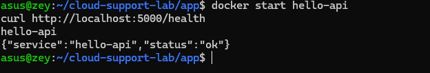

# Cloud Support Lab

A hands-on, week-long lab building foundational cloud support / DevOps skills:
Linux administration, process and service troubleshooting, networking, Docker,
and a small containerized Python service deployed and debugged end-to-end.

Environment: Ubuntu (WSL2) on Windows.

## Project Summary

Completed a self-directed, week-long Linux and Docker support engineering lab, covering SSH, Linux permissions, process/service management (systemd), networking, firewalls, and containerization. Designed, built, and deployed a containerized Python (Flask) REST API with environment-based configuration and startup-time config validation. Independently diagnosed and resolved five distinct real-world infrastructure failures — a Docker/WSL2 DNS resolution failure blocking image builds, a Linux group-permission propagation issue, a firewall (`ufw`) loopback-bypass edge case, an unplanned container outage from a host restart, and application misconfiguration scenarios — each documented below with root cause, fix, and prevention. Used core Linux and Docker diagnostic tooling (`systemctl`, `journalctl`, `ss`, `ip`, `docker inspect`, `docker logs`, `docker ps`) throughout.

---

## Day 1 — Lab Setup

**Goal:** get a working Linux environment and practice the fundamentals:
SSH, directory navigation, files & permissions, environment variables, `sudo`.

### SSH basics

| Command | What it does | Notes |
|---|---|---|
| `sudo apt install openssh-server -y` | Installs the OpenSSH server package | Needed before you can SSH into the machine at all |
| `sudo service ssh start` | Starts the SSH daemon | WSL doesn't auto-start services on boot like a normal Linux install would |
| `ssh asus@localhost` | Connects via SSH to this same machine | First connection prompts to accept the host's key fingerprint (`yes`), then asks for the password |
| `exit` | Closes the current shell / SSH session | Prints "Connection to localhost closed" when leaving an SSH session |
| `ssh -v localhost` | Same connection, but verbose | Shows the handshake step by step: key exchange, auth method offered, auth success, exit status |

### Directory navigation

| Command | What it does | Notes |
|---|---|---|
| `pwd` | Prints the current working directory | Home directory is `/home/asus` |
| `ls -la` | Lists all files, including hidden dotfiles, with details | `-l` = long format (permissions, owner, size, date), `-a` = show hidden |
| `cd ..` | Moves up one directory level | |
| `cd ~` | Jumps straight back to the home directory | Plain `cd` with no argument does the same thing |
| `mkdir testdir` | Creates a new directory | |
| `cd testdir` / `cd ..` | Moves into and back out of it | |

### Files and permissions

| Command | What it does | Notes |
|---|---|---|
| `touch file.txt` | Creates an empty file | |
| `ls -l file.txt` | Shows permission string, owner, group, size | Default was `-rw-r--r--` |
| `chmod 644 file.txt` | Sets permissions to owner read/write, everyone else read-only | `6=rw`, `4=r`, `4=r` (r=4, w=2, x=1 added per group) |
| `chmod 600 file.txt` | Sets permissions to owner read/write, no access for group/others | Confirmed via `ls -l` → `-rw-------` |
| `whoami` | Prints the current logged-in user | `asus` |
| `chown asus:asus file.txt` | Sets the file's owner and group | No visible change here since the file was already owned by `asus` — this is the command you'd use to hand a file to a different user/group |

### Environment variables

| Command | What it does | Notes |
|---|---|---|
| `echo $HOME` | Prints the value of the `HOME` variable | `/home/asus` |
| `printenv` | Lists all currently exported environment variables | WSL's `PATH` is huge because it merges Linux and Windows paths |
| `export MY_VAR=hello` | Creates a variable and exports it to child processes | Without `export`, a variable stays local to the current shell only |
| `echo $MY_VAR` | Prints the variable's value | `hello` |
| `bash` then `echo $MY_VAR` | Launches a nested child shell and checks the variable there | Still printed `hello` — proves `export` makes it inherit into child processes |
| `exit` | Leaves the nested shell, back to the parent | |

### sudo

| Command | What it does | Notes |
|---|---|---|
| `sudo whoami` | Runs a single command as root | Printed `root`, confirming elevation worked |
| `sudo -l` | Lists what the current user is allowed to run via sudo | Returned `(ALL : ALL) ALL` — this user can run any command as any user |
| `su` | Tries to switch fully to the root user | Failed with "Authentication failure" — expected, since Ubuntu disables the root account's password by default and expects `sudo` to be used instead of `su` |

**Key distinction learned:** `sudo <command>` runs one command as root using *your own* password. `su` tries to become the root user directly, which requires *root's* password — one that doesn't exist on a default Ubuntu install, which is exactly why it failed.

---

## Day 2 — Processes and Services

**Goal:** answer, from the command line: is the process running, is the
server out of disk space, is memory exhausted, what does the service log say.

| Command | What it does | Notes |
|---|---|---|
| `ps aux` | Snapshot of every running process | `%CPU`/`%MEM` show resource usage, `COMMAND` shows what's running |
| `ps aux \| grep <name>` | Filters the process list to just matches for `<name>` | Practical way to answer "is process X running?" without scrolling everything |
| `top` | Live, auto-refreshing view of running processes | `q` to exit |
| `free -h` | Shows memory usage in human-readable units | Had 7.6GB total RAM, only 615MB used — not memory-exhausted |
| `df -h` | Shows disk space per mounted filesystem | Root filesystem (`/`) was only 1% used — plenty of space |
| `du -sh ~` | Total size of the home directory | Home dir was only 148K, essentially empty |
| `systemctl status <service>` | Shows whether a systemd service is running, plus recent log lines inline | SSH showed `inactive (dead)` but `TriggeredBy: ssh.socket` — socket-activated, starts on demand rather than always running |
| `sudo systemctl start/stop <service>` | Starts or stops a systemd-managed service | Confirmed status flipped between `active (running)` and `inactive (dead)` |
| `journalctl -u <service> -n 20` | Shows the last 20 log lines for one specific systemd unit | This is what answers "what does the service log say?" in a real investigation, beyond just the current snapshot |

**Service start/stop practice:**
- Used the `ssh` service (installed on Day 1) as the practice target since it's a real, already-installed systemd unit
- Learned SSH on this system is socket-activated: `systemctl status ssh` shows `inactive (dead)` at rest, but `TriggeredBy: ssh.socket` means systemd is still listening on port 22 and will spin the service up automatically on an incoming connection
- Forcing it with `sudo systemctl start ssh` showed `active (running)`, `Main PID`, and log lines like "Server listening on 0.0.0.0 port 22" directly in the status output
- `sudo systemctl stop ssh` cleanly returned it to `inactive (dead)`

---

## Day 3 — Linux Networking

**Goal:** inspect network config, run a local web server, identify its port,
block and restore access.

| Command | What it does | Notes |
|---|---|---|
| `ip addr` | Shows network interfaces and their IP addresses | `eth0` is WSL's main interface |
| `ip route` | Shows the routing table | `default via ...` line is the gateway |
| `ping -c 4 8.8.8.8` | Tests raw connectivity to a known host | `-c 4` limits it to 4 packets instead of running forever |
| `curl -I <url>` | Fetches just the HTTP headers from a URL | Fast way to confirm a service is reachable without pulling the full response |
| `ss -tulpn` | Lists every port currently listening for connections | `-t`=TCP, `-u`=UDP, `-l`=listening only, `-p`=show owning process, `-n`=numeric ports |
| `nslookup <domain>` | Resolves a domain name to an IP address | Not installed by default — needed `sudo apt install dnsutils -y` first |

**Web server + port block/restore exercise:**
- `python3 -m http.server 8000 &` — started a simple web server in the background, confirmed with `curl -I http://localhost:8000` → `200 OK`, and confirmed it in the port list with `ss -tulpn | grep 8000`
- `sudo apt install ufw -y`, `sudo ufw allow OpenSSH`, `sudo ufw enable` — set up the firewall, allowing SSH first specifically to avoid locking myself out (standard real-world precaution)
- `sudo ufw deny 8000` — blocked the port
- **Key lesson:** `curl http://localhost:8000` and even `curl http://<own-eth0-IP>:8000` *still succeeded* after blocking the port. This is because loopback traffic, and traffic a Linux machine sends to its own IP address, gets routed internally and bypasses normal firewall INPUT filtering — this isn't a bug, it's expected host-firewall behavior.
- To actually observe the block, had to send the request from a genuinely separate origin: running `curl.exe` (the native Windows binary, reachable from inside WSL via interop) against the WSL VM's IP correctly returned `Connection timed out after 5011 milliseconds`, since that traffic truly crosses the network boundary the firewall filters.
- `sudo ufw delete deny 8000` restored access — confirmed back to `200 OK` from the same external (`curl.exe`) origin.
- **Takeaway for support work:** if a "the port seems open even though we blocked it" ticket ever comes up, check whether the test was run from the same host — local-origin tests don't exercise firewall rules the same way real client traffic does.

---

## Day 4 — Docker Fundamentals

**Setup:** installed Docker Engine directly (not Docker Desktop) via Docker's official apt repository, enabled it with `sudo systemctl enable --now docker`, and added my user to the `docker` group with `sudo usermod -aG docker $USER` so `docker` commands work without `sudo`.

**Gotcha:** the group change didn't take effect in the terminal tab it was run in, or even in a new tab in the same window — `groups` still didn't list `docker` even though `getent group docker` confirmed the membership was saved. Had to fully restart the WSL instance (`wsl --shutdown` from Windows PowerShell, then reopen Ubuntu) to get a truly fresh session that picked up the new group. Lesson: a "new terminal tab" isn't always a new enough session for Linux group changes — sometimes the whole environment needs restarting.

**Concepts:**
- **Image** — a read-only template for a container: application code, dependencies, and OS libraries bundled together, pulled from a registry like Docker Hub (e.g. `nginx`, `hello-world`)
- **Container** — a running instance of an image; an isolated process with its own filesystem view, but sharing the host machine's kernel (much lighter than a full VM)
- **Port mapping** — connects a port on the host machine to a port inside the container (`-p 8080:80` = host's 8080 → container's 80), since a container's ports aren't reachable from outside by default
- **Volume** — persistent storage that survives even if the container is deleted; without one, anything written inside a container is lost when it's removed
- **Network** — a virtual network Docker creates so containers can reach each other (or the outside world) in a controlled way

**Practice:**
```bash
docker run hello-world
docker run -d --name my-nginx -p 8080:80 nginx
docker ps
```
Ran the official Nginx image detached (`-d`) with port 8080 on the host mapped to port 80 in the container, then confirmed it from a Windows browser at `http://localhost:8080` — the default "Welcome to nginx!" page loaded. `docker ps` showed the running container, its image, and the exact port mapping (`0.0.0.0:8080->80/tcp`).

---

## Day 5 — Containerize a Tiny Python Service

A minimal Flask API with a single `/health` endpoint, packaged with Docker.

- [`app/main.py`](./app/main.py) — the service source
- [`app/Dockerfile`](./app/Dockerfile)
- [`app/requirements.txt`](./app/requirements.txt)

Run instructions: see [`app/README.md`](./app/README.md).

```bash
cd app
docker build -t hello-api .
docker run -d --name hello-api -p 5000:5000 hello-api
curl http://localhost:5000/health
```

**Issues hit while building this:**

1. **`pip install` failed inside the build with `Temporary failure in name resolution`.** The container couldn't resolve DNS to reach PyPI, even though the host machine's own networking worked fine. Cause: `/etc/resolv.conf` on this WSL2 host points to `10.255.255.254`, WSL's internal DNS forwarder back to Windows — but Docker's container network (a separate bridge) can't reach that address. Fix: pointed the Docker daemon at a public DNS server directly via `/etc/docker/daemon.json`:
   ```json
   {"dns": ["8.8.8.8", "1.1.1.1"]}
   ```
   then `sudo systemctl restart docker`, after which the build succeeded.

2. **First `curl` after `docker run -d` returned `Connection reset by peer`.** Not a real failure — `docker run -d` returns control immediately, before Flask's dev server had finished starting up inside the container. `docker ps -a` showed the container as `Up`, and `docker logs hello-api` confirmed Flask was running and listening on `0.0.0.0:5000`; a second `curl` a few seconds later succeeded normally. Lesson: a fresh detached container needs a moment before its app inside is actually ready — don't read a request failure immediately after start as proof the app is broken.

---

## Day 6 — Break and Troubleshoot It

Deliberate failures introduced, then diagnosed with `docker ps`, `docker logs`,
`docker inspect`, `curl`, `ss -tulpn`.

| Problem | Evidence | Fix | Prevention |
|---|---|---|---|
| Wrong port mapped | Ran the container with `-p 5001:5000` but tested `curl http://localhost:5000/health`. `curl` returned `(7) Could not connect to server`. `docker ps` showed `PORTS: 0.0.0.0:5001->5000/tcp` (host 5001 → container 5000, not 5000→5000), and `ss -tulpn` confirmed only port 5001 was actually listening on the host. | Used the correct host port (`curl http://localhost:5001/health` worked immediately), or re-ran the container with the intended mapping (`-p 5000:5000`). | Standardize on one documented host port per service, and when someone reports "the service is down," check the *actual* port mapping with `docker ps` before assuming the app itself is broken — this is one of the most common false-alarm tickets in real support work. |
| Container stopped | Unplanned: `docker ps -a` showed `hello-api` as `Exited (255)`, discovered after the WSL VM itself had restarted (laptop sleep/reboot) between sessions, silently killing the running container. `docker logs` showed a perfectly healthy session with a successful request right up to the moment it stopped — no in-app error at all. Separately, a deliberate `docker stop hello-api` produced `Exited (137)` (`128+9` = killed via `SIGKILL`, since Flask's dev server doesn't handle `SIGTERM` gracefully within Docker's ~10s grace period). | `docker start hello-api` brought it back immediately in both cases — a stopped container still exists (image, config, and logs intact) and is different from one that's been `rm`'d. | Clean logs + abrupt stop with no application error = look at the *host/environment* (crash, reboot, OOM-kill), not the app code. An error message immediately before the stop = look at the app. Don't assume "container down" always means "app broken." |
| Missing environment variable | Ran `docker run` without `-e SERVICE_NAME=...`. Container briefly showed `Up` in `docker ps -a` then transitioned to `Exited`. `docker logs hello-api` showed a clear, self-explanatory message: `FATAL: required environment variable SERVICE_NAME is not set`. | Re-ran the container with `-e SERVICE_NAME=hello-api` set. | This is a case where the *application* did the right thing — validating required config at startup and failing loudly and immediately, instead of starting in a broken state or crashing mysteriously later on first use. `docker logs` should always be the first command run when a container won't stay up. |
| Invalid configuration | Ran the container with `-e PORT=abc` (non-numeric). Same failure pattern — briefly `Up`, then `Exited`. `docker logs` showed: `FATAL: PORT must be an integer, got 'abc'`. | Re-ran without the bad `PORT` override (falls back to the default `5000`), or supplied a valid integer. | Validating configuration values (not just their presence) at startup, with a specific error message naming the bad value, turns a vague "container keeps crashing" ticket into a two-second diagnosis. Worth building into any service from day one. |

---

## Day 7 — Wrap-up

### Screenshot

The service running and responding to a health check:



### What I learned

- **Reading evidence beats guessing.** Every failure this week (wrong port, stopped container, missing env var, bad config, the DNS build failure) was solvable in seconds once I actually looked at `docker logs`, `docker ps -a`, or `ss -tulpn` instead of assuming what was wrong.
- **"Not working" has more than one shape, and the shape tells you where to look.** A clean, healthy log followed by an abrupt stop points at the environment (a crash, a reboot). An explicit error message right before the stop points at the app. Knowing which one you're looking at saves a lot of wasted investigation time.
- **Host-level tools don't always test what you think they test.** Curling `localhost` (or even your own machine's real IP) to check a firewall rule doesn't actually exercise that rule, because loopback and self-addressed traffic bypass normal firewall filtering. Real client traffic has to come from somewhere else to prove anything.
- **Containers inherit the host's networking assumptions, but not perfectly.** The Docker DNS failure (`Temporary failure in name resolution`) happened because WSL2's DNS forwarder address isn't reachable from inside Docker's own bridge network — a mismatch that's invisible until you actually try to build something that needs the internet.
- **A "new terminal" isn't always a new session.** Linux group membership changes (like adding a user to the `docker` group) don't apply retroactively to already-running shells, and in WSL that can mean even a fresh terminal tab shares the same underlying instance — a full `wsl --shutdown` was needed to get a truly clean session.
- **Validating configuration at startup, with a specific error message, turns a mystery outage into a two-second fix.** The `hello-api` service refusing to start with `FATAL: required environment variable SERVICE_NAME is not set` was more useful than any amount of clever monitoring would have been after the fact.
- **Documentation is part of the work, not an afterthought.** Writing down each command and each failure as it happened (rather than reconstructing it later) made the troubleshooting log both more accurate and much less effort to produce.

---

## Repo Contents

- `app/` — Python service, Dockerfile, requirements.txt
- `README.md` — this file: setup notes, command log, troubleshooting log, and takeaways
